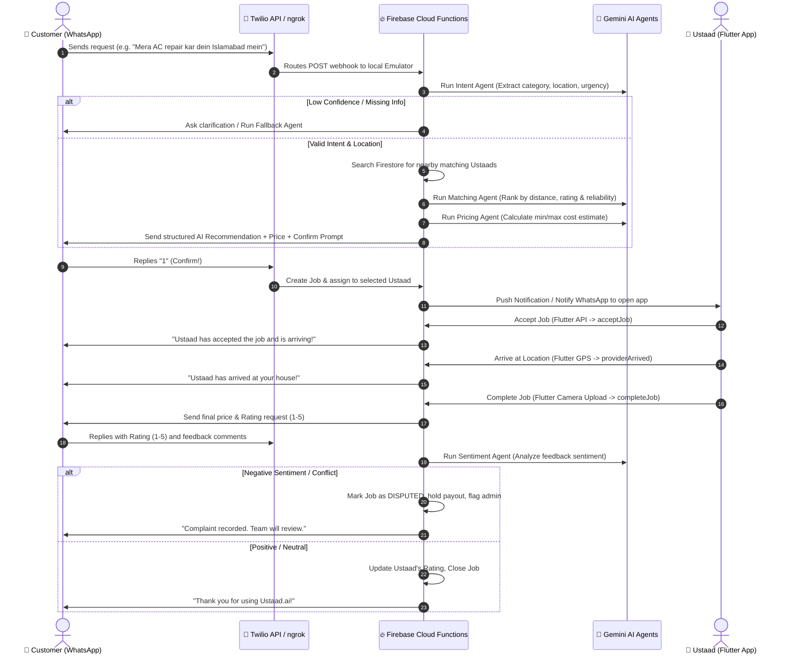

# 👷 Ustaad.ai — AI-Powered Worker Matching & Informal Economy Platform

**Ustaad.ai** is an advanced, event-driven, AI-agentic platform built to connect customers looking for local service experts ("Ustaads") directly with handymen (plumbers, electricians, AC repair technicians) using a seamless conversational interface on **Twilio WhatsApp** and a high-performance **Flutter Mobile Application** for the service providers.

The entire system's logic, flows, and integrations were co-designed and engineered with **Antigravity**, utilizing **Google Gemini** to power multi-agent decision systems and **Firebase Emulators** for local local development and testing.

---

## 🏗️ System Architecture & Workflow

Here is how the entire platform orchestrates requests between customers (WhatsApp), the AI Multi-Agent Backend, and the service providers (Flutter App):



---

## 🧠 The AI Agents (Powered by Gemini)

The system employs **5 specialized AI agents** that run asynchronously in Firebase Cloud Functions to parse natural language, negotiate pricing, and select the optimal provider:

1. **`intentAgent`**: Extracts the core service category (Plumbing, Electrician, AC Repair), specific subtype (e.g. leaking pipe), location/area, and urgency level from unstructured Urdu/English/Roman Urdu chat.
2. **`matchingAgent`**: Ranks active providers based on live distance, past customer ratings, and a computed reliability score to determine the best provider for the job.
3. **`pricingAgent`**: Generates a dynamic and transparent price estimate range depending on distance and time-sensitivity/urgency.
4. **`sentimentAgent`**: Analyzes the post-service feedback from the customer. If it flags hostile sentiment or disputes, it pauses automatic payment processing and triggers a manual dispute workflow.
5. **`fallbackAgent`**: Handles system fallbacks gracefully (e.g. low intent confidence, no active providers online, or provider timeouts).

---

## ⚙️ Setup and Installation

### Prerequisites
* [Flutter SDK](https://docs.flutter.dev/get-started/install) (v3.0.0+)
* [Node.js](https://nodejs.org/) (v24 recommended, compatible with 18+)
* [Firebase CLI](https://firebase.google.com/docs/cli) (`npm install -g firebase-tools`)
* [ngrok CLI](https://ngrok.com/download) (for webhook tunneling)
* Java Runtime Environment (JRE) (required for Firebase Local Emulators)

---

## 🔧 1. Backend Setup & Running Emulators

1. **Navigate to the backend directory:**
   ```powershell
   cd ustaad-backend
   ```

2. **Install Node.js dependencies:**
   ```powershell
   cd functions
   npm install
   cd ..
   ```

3. **Configure Environment Variables (`.env`):**
   Create a `.env` file in the `ustaad-backend/` root directory (this is automatically loaded by the functions emulator and is ignored by git for security).
   
   Add the following variables with your actual credentials:
   ```env
   TWILIO_ACCOUNT_SID=your_twilio_sid
   TWILIO_AUTH_TOKEN=your_twilio_auth_token
   TWILIO_WHATSAPP_NUMBER=whatsapp:+14155238886
   GEMINI_API_KEY=your_gemini_api_key
   CLOUDINARY_CLOUD_NAME=your_cloudinary_cloud_name
   CLOUDINARY_UPLOAD_PRESET=your_cloudinary_preset
   ```

4. **Build the TypeScript backend functions:**
   ```powershell
   npm --prefix functions run build
   ```

5. **Start the Firebase Emulators:**
   ```powershell
   firebase emulators:start
   ```
   > [!TIP]
   > You can access the **Firebase Emulator Suite UI** in your web browser at `http://localhost:4000` to inspect Firestore data, active triggers, and view logs in real time.

---

## 📱 2. Twilio WhatsApp Hook & ngrok Tunneling

To receive real-time messages from Twilio's WhatsApp API to your local emulator, you must expose port `5001` to the internet using `ngrok`:

1. **Fire up the ngrok tunnel:**
   ```powershell
   ngrok http 5001
   ```
   ngrok will generate a secure public URL (e.g., `https://abcd-1234.ngrok-free.app`).

2. **Configure your Twilio Sandbox Webhook:**
   * Go to your **Twilio Console** -> **Messaging** -> **Try it out** -> **Send a WhatsApp message**.
   * Under the **Sandbox Settings**, set the webhook for **"When a message comes in"** to your public ngrok URL appended with the function route:
     ```text
     https://<your-ngrok-subdomain>.ngrok-free.app/ustaad-ai-ce5e2/us-central1/whatsappWebhook
     ```
   * Set the HTTP request method to **POST** and save.

---

## 💻 3. Frontend Setup & Running the Mobile App

The frontend is an event-driven Flutter mobile app optimized for local workers.

1. **Navigate to the frontend directory:**
   ```powershell
   cd ustaad-ai
   ```

2. **Retrieve dependencies:**
   ```powershell
   flutter pub get
   ```

3. **Backend Integration configuration:**
   The Flutter app integrates with both Firestore and your local Cloud Functions endpoint. Ensure your local network endpoints are mapped correctly inside `lib/core/constants/api_endpoints.dart` to talk to the local emulator:
   * **Android Emulator IP:** `http://10.0.2.2:5001/ustaad-ai-ce5e2/us-central1`
   * **iOS Simulator / Web IP:** `http://localhost:5001/ustaad-ai-ce5e2/us-central1`

4. **Run the application:**
   Ensure you have a simulator/device running:
   ```powershell
   flutter run
   ```

---

## 💡 Key Terminal Command Summary

Here is a quick cheat sheet of commands you'll use day-to-day:

| Process | Directory | Command |
| :--- | :--- | :--- |
| **Install Backend Deps** | `ustaad-backend/functions` | `npm install` |
| **Build TS Functions** | `ustaad-backend` | `npm --prefix functions run build` |
| **Start Local Emulator** | `ustaad-backend` | `firebase emulators:start` |
| **Expose Local Webhook** | Anywhere | `ngrok http 5001` |
| **Run Flutter App** | `ustaad-ai` | `flutter run` |

---

> [!IMPORTANT]
> **Security Reminder**: Never push or expose your `.env` file to remote version control. The root-level `.gitignore` has been thoroughly configured to prevent environment and credential leaks.
